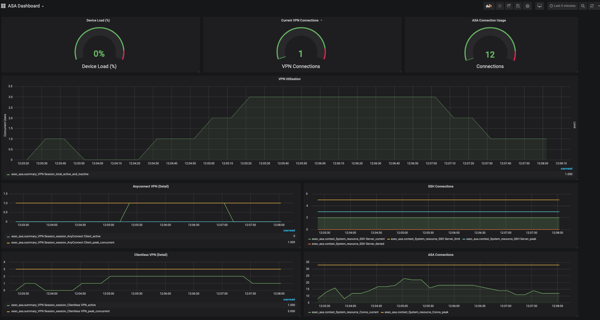

# ASA VPN Health Monitoring 
### Example VPN health monitoring dashboard on Grafana for ASA devices [BETA]

With recent events, home working and VPN access have became a priority for many IT organisations, the often forgotten about ASA has became a mission critical part of our IT infrastructure. The challenge however is how do we monitor these devices on an ongoing basis to look for trends in usage, peaks and spot any potential issues with dashboards like below.



In this short lab guide we'll explore the process of collecting data that exists in the command line however is very difficult to collect and monitor on an ongoing basis much as we'd do with Model Driven Telemetry[Link to MDT lab]. In this example we will take CLI output from the firewall using pyATS and parse the output to create a standard JSON output. From this standard JSON output we can use open source data stacks such as TIG (Telegraf, InfluxDB and Grafana) to collect, store and visualise data from ASA devices.


```
Note: This lab uses beta parsers from the pyATS project, they have not been throughly tested in all environments so please proceed with caution, much of what we're going to do here will just be connecting to a device via SSH and reading the show command output so risk is limited but please take this into account.
```

To run these exercises you will need an instance of an ASA. dCloud has an ASA instance configured for remote that you can reserve and use in this. We'll be using the "Cisco AnyConnect Posture with ASA, ISE, and AMP v1.2" demo. Alternatively you can also use your own ASA if you have one available. This has been tested against ASA Version 9.5(2)203.

# Step 1 - Installing Docker

First off we'll need an environment with the TIG stack installed that we can use, for this guide I'll use a Docker container to automate much of this proccess. If you already have docker installed you can proceed to Step 2 and start to pull down the containers required. If you do not have docker installed you can consult the docker documentation here

Alternatively you could install the TIG stack on your own system, they are numerous guides on how to do this online. For completeness we'll walk through all the steps here.

## Step 2 - Setup our TIG stack

Thankfully, Jeremy Cohoe has created a fantastic docker container with all the needed components preinstalled. You can pull the container from the Docker hub with the following shell command.

```
docker pull jeremycohoe/tig_mdt
```

Let that pull down the required image from Docker hub then run the following command to start the container.

```
docker run -ti -p 3000:3000 -p 57500:57500 jeremycohoe/tig_mdt
```

As this docker container wasn't fully build for what we're looking to do we need to do some further configuration to do this, from your shell use the command ```docker ps``` to display your container id. Take the containerid vaue which should be 12 digit alphanumeric string and then use the command ```docker exec -it <CONTAINER ID HERE> /bin/bash``` Once you do that you should have root prompt for your container.

Now we're in use the following commands to install the necessary components and packages, run these one after the other

```
apt-get update && apt-get upgrade
apt-get install python3
apt-get install python-pip && python-env
apt-get install git
apt-get install ssh
```

Now create some directories we'll use later

```
mkdir /opt/telegraf
cd /opt/telegraf
```

And clone this repo into the folder and create a python virtual environment, A Virtual Environment acts as isolated working copy of Python which allows you to work on a specific project without worry of affecting other projects. It is strongly recommended that you use this as it creates an isolated environment for our exercise and allows us to create it's can have its own dependencies, regardless of what other packages are installed on the system.

```
git clone https://github.com/sttrayno/ASA-Telemetry-Guide.git
python3 -mvenv env3
source env3/bin/activate
```

Finally install the Python package requirements too with the pip command.

```
pip install -U pip
pip install pyats[full]
pip install genie.libs.parser --upgrade --pre
pip install jsonmerge
```
Once you've configured your environment all that is left to do is now test to see if things are working. Try running the following command from the shell which will test using our collection script 

```
/opt/telegraf/telegraf/env3/bin/python /opt/telegraf/telegraf/scripts/asascript.py
```

You may get an error if the script runs that pyats has failed to bring the device into an any state. If this happens one of the possible causes is that the devices ssh keys it are offering are not accepted by the ssh daemon on ubuntu. I have had this on some older ASA models. To fix this add the lines below to the bottom of the /etc/ssh/ssh_config file in the container.

```
KexAlgorithms diffie-hellman-group1-sha1
Ciphers 3des-cbc
```

Another potential issue is that the testbed-asa.yaml file in the director telegraf/scripts directory is not accurate for your device, ensure credentials, IP and device names all match in the topology and your environment.


Note: I am using the TIG stack container from Jeremy Cohoe as I've mentioned. I am planing on rewriting parts of this lab with a fresh TIG stack install however for ease of use today we will be using Jeremy's container which I've also used in other labs.

## Step 3 - Configure Telegraf and Build Dashboards


